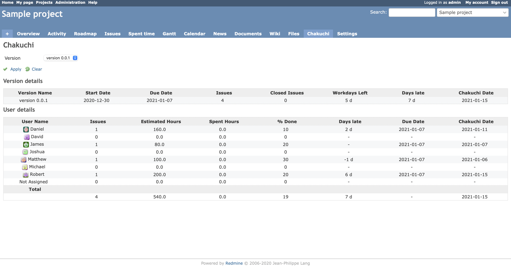
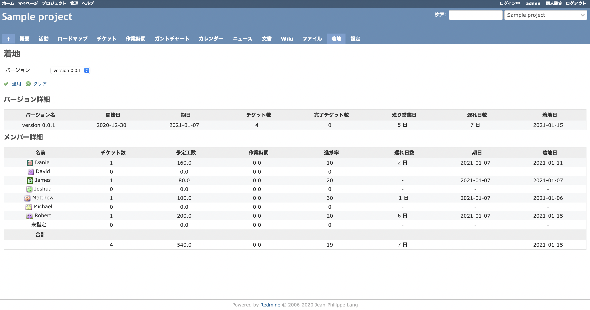
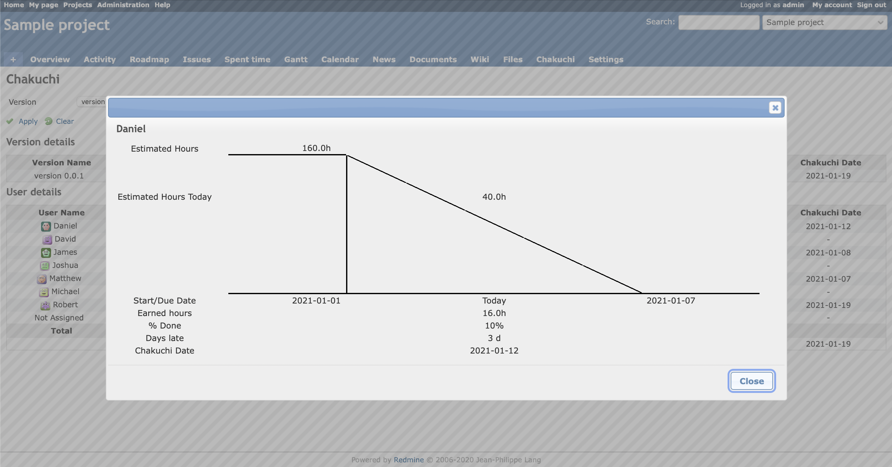
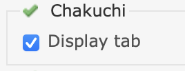

# Redmine chakuchi plugin
This plugin shows estimated completion date of the project version.  
This is a trivia, Chakuchi is Japanese word means landing.

## What's new
* Added a dialog for calculation check. See screenshot.

## Auther's comments
* I bought an apple sillicon macbook air recently, so I developed this with great momentum. Lol
* I think the EVM method is great, but recently I've been focusing on the number of days left until the completion date to manage the project.
* Any question and request is welcome. Please write a issue on GitHub.

## Features
* It is possible to know estimated completion date of the project version as of today.
* It is possible to know the number of days late as of today.
* Supports English and Japanese language.
* Easy installation. No migration.

## Screenshots

### English overview

### Japanese overview

### Dialog for calculation check

## Description of each items

### Table of version details
* Version Name : This is name of the version.
* Start Date : This is the earliest start date of the tickets included in the version.
* Due Date : This is due date of the version.
* Issues : This is the number of tickets included in the version.
* Closed Issues : This is the number of closed tickets included in the version.
* Workdays Left : This is the number of business days from today to the due date of the version. Excludes Saturdays and Sundays.
* Days late : This is the total number of days late for all members.
* Chakuchi Date : This means estimated completion date of the version. Excludes Saturdays and Sundays.

### Table of user details
* User Name : This is name of the member.
* Issues : This is the number of tickets the member has.
* Estimated Hours : This is total estimated hours of tickets the member has.
* Spent Hours : This is total spent hours of tickets the member has.
* % Done : This is average of progress rate of tickets the member has.
* Days late : This is the number of days late as of today. The planned value as of today are calculated by linearly interpolating the estimated hours between the start date and the due date. Then, it is calculated from the value obtained by subtracting the earned value as of today. Plus value indicates delay. I'm doing it with a simplified EVM. This is clickable to show dialog.
* Due Date : This is the latest due date of tickets the member has. 
* Chakuchi Date : This means estimated completion date of tickets the member has. Excludes Saturdays and Sundays.

## Requirments
* Tickets : Enter the start date, due date and estimated hours as much as possible. It is not a required, but if you enter all of them, the accuracy will increase.
* Version : Due date of the version is a required.

## How to install

1. Move to plugins folder.
<pre>
git clone https://github.com/happy-se-life/chakuchi.git
</pre>

2. Edit models/constants.rb for your environment.

3. Set the time zone.
Example for Japanese : Add below a line into config/application.rb.  
<pre>
config.time_zone = 'Asia/Tokyo'
</pre>

4. Restart redmine.

5. Enable role permission to each users groups  

6. Enable modules for each project.

## How to uninstall

1. Move to plugins folder.

2. Remove plugins folder.
<pre>
rm -rf chakuchi
</pre>

3. Restart redmine.

## Weakpoints and Hints
I don't think it's necessary to explain to an experienced project manager.
* The planned value as of today is linearly interpolated. Therefore, the days late as of today may be inaccurate. It may or may not be reasonable.
* The planned value is most important for accuracy. Don't be afraid to update estimated hours of a ticket frequently to take advantage of this plugin.
* % Done is also important as it affects earned value. %done tends to be entered subjectively, and I think it should be linked with the status if possible.
* So don't think too hard. The manager pays the latest attention to the members' minds, regardless of whether they are on the desk.
* Working days exclude Saturdays and Sundays. I also want to consider the holidays of each country.

## License
* MIT Lisense

